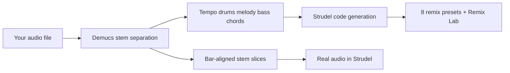

# LTW Audio v2

**Free, local, privacy-first audio splitter + Strudel live-coding studio**

Turn any song into separated stems, musical analysis, and editable **Strudel** patterns — then remix it in the browser. Built for **Mac M4 / Apple Silicon** (Demucs via MPS). No uploads. No subscriptions.

[GitHub](https://github.com/Eli-Dolney/LTW_Audio_Spiltter) · [Strudel](https://strudel.cc)

---

## What v2 does



| Step | Output |
|------|--------|
| **Split** | `vocals`, `drums`, `bass`, `other` WAV stems |
| **Analyze** | BPM, beat grid, MIDI, chord progression, key |
| **Generate** | `building_blocks.js`, `arrangement.js`, 8 `remix_*.js` files |
| **Remix Lab** | Custom remix with layer toggles, style presets, seed + intensity |
| **Stem slices** | Real stem audio chopped by bar — playable in Strudel |

---

## Highlights

### Remix Engine
Eight ready-to-paste remix styles generated from *your* song's extracted patterns:
- Phat Analog · Glitch / IDM · Lo-Fi · Trance · Nostalgia
- UK Garage · Phonk · House

### Remix Lab (in-app)
- Toggle drums / bass / melody / chords
- Pick per-layer sounds and a global style preset
- Variation intensity slider + seed reroll
- Live preview + download `custom_remix.js`

### Stem slice playback
The differentiator: play **actual separated audio** inside Strudel, not just synth approximations. Slices are cut on the beat grid; shuffle/euclid modes for instant flip remixes.

### Smarter Strudel extraction
- Drum **dynamics** from onset strength → `.gain()` patterns
- Melody/bass **note length** → `c4@2` sustain notation
- **Swing detection** → `.swingBy()` when the groove is swung
- **Per-section patterns** — verse material in verses, chorus in choruses
- Compressed, readable mini-notation (`hh*4` not 16 raw tokens)

### Mac M4 optimized
- Demucs on **MPS** (Apple Silicon GPU), CPU fallback
- Melody via **librosa pYIN** — no TensorFlow, no CREPE headaches
- One-command setup: `./setup.sh` → `./quick_start.sh`

---

## Quick start (Mac)

```bash
git clone https://github.com/Eli-Dolney/LTW_Audio_Spiltter.git
cd LTW_Audio_Spiltter
chmod +x setup.sh quick_start.sh
./setup.sh
./quick_start.sh
```

Open **http://localhost:8501**, upload a track, then:

1. **Separate stems** (Demucs 4-stem)
2. **Run full analysis** (tempo, drums, melody, bass, chords)
3. **Generate Strudel replica** → explore **Remix Lab** and **Stem Slices** tabs

### Stem slices on strudel.cc

After generating patterns, each project gets a `serve_samples.py`:

```bash
cd projects/Your_Song_Name
python3 serve_samples.py
# Paste projects/Your_Song_Name/strudel/stem_remix.js into strudel.cc
```

### Streamlit static serving (optional)

For in-app slice playback:

```bash
mkdir -p .streamlit
cp .streamlit/config.toml.example .streamlit/config.toml
```

---

## Requirements

- **Python 3.9+** (3.10+ recommended)
- **8 GB RAM** recommended for Demucs
- **macOS** (Apple Silicon native) · Windows · Linux

Dependencies install via `requirements.txt` — core stack: Streamlit, librosa, Demucs, PyTorch, pretty_midi, Plotly.

---

## Project layout

```
LTW_Audio_Spiltter/
├── app.py                      # Streamlit UI
├── config.py                   # Settings (Demucs default, v2.0.0)
├── setup.sh / quick_start.sh   # Mac setup & launch
├── src/
│   ├── separation.py           # Demucs (MPS-aware)
│   ├── drums.py / melody.py / chords.py / timing.py
│   ├── strudel_integration.py  # Pattern → Strudel code
│   ├── strudel_patterns.py     # Swing, compression, key snap
│   ├── remix_engine.py         # 8 presets + variation generator
│   ├── stem_slices.py          # Bar-aligned slice + samples()
│   ├── strudel_player_component.py
│   └── create_studio.py        # Template beat browser
├── examples/strudel/           # Demo Strudel snippets
└── projects/                   # Your work (gitignored — stays local)
```

---

## Workflow

### Replicate mode
Upload → separate → analyze → **Generate Strudel replica** → play arrangement, remixes, or stem slices.

### Create mode
Browse genre templates (hip-hop, house, DnB, etc.) and the WiredUp beat gallery — no source track required.

### Export
MIDI, analysis JSON, Strudel `.js` / `.html`, ZIP packages, DAW metadata.

---

## Examples

Try the included Strudel demos in `examples/strudel/` or paste generated code at [strudel.cc](https://strudel.cc).

```javascript
// v2 building blocks pattern (simplified)
setcpm(30);
let drums  = s("bd ~ sd ~ bd ~ sd ~").bank("RolandTR808").gain(0.9)
let bass   = note("c2 ~ g1 ~ c2 ~ g1 ~").sound("gm_synth_bass_1").lpf(400)
let melody = note("c4@2 ~ e4 ~ g4 ~").sound("triangle").lpf(1800)
let chorus = stack(drums, bass, melody)
chorus
```

---

## Privacy

- All processing runs **on your machine**
- Personal audio and projects are **gitignored** by default
- Strudel live player loads `@strudel/web` from CDN (internet needed for in-app playback only)
- Offline: use downloaded `.html` / `.js` files with strudel.cc or local sample server

---

## What's gitignored (stays local)

Your clone stays clean for GitHub — these never get pushed:

- `projects/` — your songs, stems, analysis, Strudel output
- `*.wav`, `*.mp3`, and other media
- `GUIDE.md`, `legacy/`, `dev/`, `.cursor/` — personal dev notes
- `regenerate_strudel.py`, `slim_projects.py`, `check_env.py` — local dev scripts
- `venv/`, `.streamlit/config.toml`, `static/slices/`

See [CHANGELOG.md](CHANGELOG.md) for the full v2 release notes.

---

## Contributing

Issues and PRs welcome on [GitHub](https://github.com/Eli-Dolney/LTW_Audio_Spiltter/issues).

```bash
git clone https://github.com/Eli-Dolney/LTW_Audio_Spiltter.git
cd LTW_Audio_Spiltter
python3 -m venv venv && source venv/bin/activate
pip install -r requirements.txt
streamlit run app.py
```

---

## Acknowledgments

[Demucs](https://github.com/facebookresearch/demucs) · [librosa](https://librosa.org) · [Strudel](https://strudel.cc) · [Streamlit](https://streamlit.io)

---

**LTW Audio v2** — split it, analyze it, Strudel it, remix it. All on your Mac.
